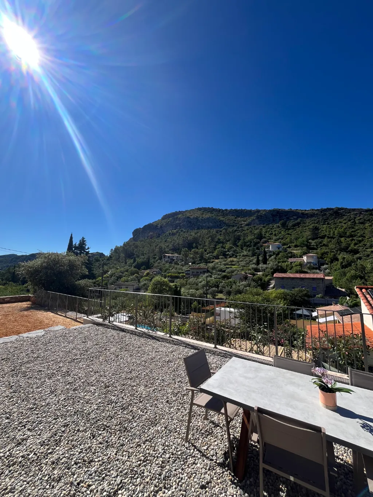

# Plan d'action SEO — villaanduze.fr

> Priorités : 🔴 Critique (à corriger immédiatement) · 🟠 Élevé (sous 1 semaine) · 🟡 Moyen (sous 1 mois) · 🟢 Faible (backlog).
> Tous les correctifs ci-dessous sont **prêts à coller** dans le dépôt.

---

## 🔴 CRITIQUE

### C1 — Titres & meta descriptions uniques (5 pages)
Remplacer la balise `<title>Villa 'nduzienne</title>` et la `<meta name="description">` (identiques partout) par des versions uniques :

| Page | `<title>` proposé (≤ 60 car.) | `<meta description>` (≤ 155 car.) |
|---|---|---|
| `/index.html` | `Gîte à Anduze avec piscine 6 pers. – Villa Anduzienne` | `Gîte neuf tout confort près d'Anduze (Cévennes) : piscine privée, vue panoramique, 6 personnes. Réservez votre séjour nature en famille.` |
| `/photos/` | `Photos du gîte près d'Anduze – Villa Anduzienne` | `Découvrez en images notre gîte près d'Anduze : piscine, terrasse vue Cévennes, intérieur, chambres. Visite photo avant réservation.` |
| `/equipements/` | `Équipements du gîte (piscine, clim, Starlink) – Anduze` | `Tous les équipements du gîte près d'Anduze : piscine sécurisée, climatisation, cuisine équipée, Starlink, espace famille. Confort 6 personnes.` |
| `/activites/` | `Que faire autour d'Anduze ? Activités Cévennes` | `Bambouseraie, Pont du Gard, train à vapeur, grotte de Trabuc… Les meilleures activités à faire depuis notre gîte près d'Anduze.` |
| `/contact/` | `Contact & réservation – Gîte Villa Anduzienne, Anduze` | `Réservez votre séjour au gîte près d'Anduze : 280 €/nuit pour 6 pers. Tél, email et disponibilités. Arrivées le samedi, juillet-août.` |

> **Important :** harmoniser le nom de marque. Choisir **une** forme (recommandé : « Villa Anduzienne ») et l'utiliser partout (title, H1, footer, Schema, Google Business).

---

### C2 — Données structurées JSON-LD
Ajouter ce bloc dans le `<head>` de **`/index.html`** (adapter l'adresse exacte et les coordonnées GPS précises) :

```html
<script type="application/ld+json">
{
  "@context": "https://schema.org",
  "@type": "LodgingBusiness",
  "@id": "https://villaanduze.fr/#gite",
  "name": "Villa Anduzienne",
  "description": "Gîte neuf tout confort pour 6 personnes avec piscine privée et vue sur les Cévennes, à proximité d'Anduze.",
  "url": "https://villaanduze.fr/",
  "image": "https://villaanduze.fr/public/presentation_1920px.webp",
  "telephone": "+33607472921",
  "email": "contact@villaanduze.fr",
  "priceRange": "280€/nuit",
  "petsAllowed": false,
  "numberOfRooms": 3,
  "maximumAttendeeCapacity": 6,
  "address": {
    "@type": "PostalAddress",
    "streetAddress": "ADRESSE EXACTE À COMPLÉTER",
    "addressLocality": "Anduze",
    "postalCode": "30140",
    "addressRegion": "Occitanie",
    "addressCountry": "FR"
  },
  "geo": {
    "@type": "GeoCoordinates",
    "latitude": 44.0536,
    "longitude": 3.9837
  },
  "amenityFeature": [
    { "@type": "LocationFeatureSpecification", "name": "Piscine privée sécurisée", "value": true },
    { "@type": "LocationFeatureSpecification", "name": "Climatisation", "value": true },
    { "@type": "LocationFeatureSpecification", "name": "Wi-Fi (Starlink)", "value": true },
    { "@type": "LocationFeatureSpecification", "name": "Cuisine équipée", "value": true },
    { "@type": "LocationFeatureSpecification", "name": "Parking gratuit", "value": true },
    { "@type": "LocationFeatureSpecification", "name": "Barbecue", "value": true },
    { "@type": "LocationFeatureSpecification", "name": "Lave-linge / sèche-linge", "value": true }
  ]
}
</script>
```

> ⚠️ Vérifier les **coordonnées GPS** (celles ci-dessus sont approximatives, centrées sur Anduze) et compléter l'**adresse exacte**.
> Quand les avis Google seront rapatriés, ajouter un bloc `aggregateRating`.
> Valider ensuite sur https://search.google.com/test/rich-results.

---

### C3 — robots.txt + sitemap.xml
Le site étant déployé tel quel, créer ces fichiers **à la racine** (et `public/` pour cohérence locale).

**`robots.txt`**
```
User-agent: *
Allow: /

Sitemap: https://villaanduze.fr/sitemap.xml
```

**`sitemap.xml`**
```xml
<?xml version="1.0" encoding="UTF-8"?>
<urlset xmlns="http://www.sitemaps.org/schemas/sitemap/0.9">
  <url><loc>https://villaanduze.fr/</loc><changefreq>weekly</changefreq><priority>1.0</priority></url>
  <url><loc>https://villaanduze.fr/photos/</loc><changefreq>monthly</changefreq><priority>0.8</priority></url>
  <url><loc>https://villaanduze.fr/equipements/</loc><changefreq>monthly</changefreq><priority>0.8</priority></url>
  <url><loc>https://villaanduze.fr/activites/</loc><changefreq>monthly</changefreq><priority>0.7</priority></url>
  <url><loc>https://villaanduze.fr/contact/</loc><changefreq>yearly</changefreq><priority>0.6</priority></url>
</urlset>
```
> Puis soumettre le sitemap dans **Google Search Console** (et créer la propriété si elle n'existe pas).

---

### C4 — Canonical + redirection www → non-www
**a)** Ajouter dans le `<head>` de chaque page une canonical absolue :
- `/index.html` → `<link rel="canonical" href="https://villaanduze.fr/" />`
- `/photos/` → `.../photos/`, etc.

**b)** Remplir le `.htaccess` (actuellement vide) :
```apache
# Forcer HTTPS + non-www
RewriteEngine On
RewriteCond %{HTTP_HOST} ^www\.villaanduze\.fr [NC]
RewriteRule ^(.*)$ https://villaanduze.fr/$1 [L,R=301]

# Cache navigateur (assets versionnés)
<IfModule mod_expires.c>
  ExpiresActive On
  ExpiresByType text/css "access plus 1 year"
  ExpiresByType application/javascript "access plus 1 year"
  ExpiresByType image/webp "access plus 6 months"
  ExpiresByType image/svg+xml "access plus 6 months"
</IfModule>

# En-têtes de sécurité
<IfModule mod_headers.c>
  Header set X-Content-Type-Options "nosniff"
  Header set Referrer-Policy "strict-origin-when-cross-origin"
  Header set Strict-Transport-Security "max-age=31536000; includeSubDomains"
</IfModule>
```

---

### C5 — Lien téléphone cassé (page Contact)
Dans `/contact/index.html`, le lien ne correspond pas au numéro affiché :
```html
<!-- AVANT -->
<li>Tel: <a href="tel:9051290512">06 07 47 29 21</a></li>
<!-- APRÈS -->
<li>Tel: <a href="tel:+33607472921">06 07 47 29 21</a></li>
```
Rendre aussi l'email cliquable : `<li>Mail: <a href="mailto:contact@villaanduze.fr">contact@villaanduze.fr</a></li>`

---

## 🟠 ÉLEVÉ

### H1 — Open Graph & Twitter Cards
Ajouter dans le `<head>` de chaque page (exemple accueil) :
```html
<meta property="og:type" content="website" />
<meta property="og:title" content="Gîte à Anduze avec piscine 6 pers. – Villa Anduzienne" />
<meta property="og:description" content="Gîte neuf tout confort près d'Anduze (Cévennes) : piscine privée, vue panoramique." />
<meta property="og:image" content="https://villaanduze.fr/public/presentation_1920px.webp" />
<meta property="og:url" content="https://villaanduze.fr/" />
<meta property="og:locale" content="fr_FR" />
<meta name="twitter:card" content="summary_large_image" />
```

### H2 — Optimiser l'image LCP (accueil)
Sur `` :
```html

```
- Ajouter `sizes`, `width`/`height` (anti-CLS), `fetchpriority="high"`.
- Mettre un `src` de repli plus léger (1024px) et **supprimer/alléger** la variante 2560px (7 Mo) ou la plafonner.

### H3 — Recompresser les images pleine résolution
- Plafonner toutes les photos de `public/photo` à **≤ 1920px de large et < 300 Ko** (actuellement jusqu'à 11,6 Mo). La lightbox ouvrira alors des images raisonnables.
- Générer une vraie version intermédiaire pour la lightbox (ex. `_1280px.webp`) et la cibler dans `modale.js` au lieu du `src` pleine résolution.
- Compresser la vidéo `VID_0001` (18,7 Mo) ou la passer en lien externe (YouTube/Vimeo non listé).

### H4 — Corriger les `alt` erronés (page Activités)
Remplacer les `alt="La foule durant le marché nocture"` dupliqués par des descriptions correctes :
- Vélorail Thoiras → `alt="Vélorail de Thoiras dans les Cévennes"`
- Poterie d'Anduze → `alt="Jarres et poteries d'Anduze"`
- Marché du jeudi → `alt="Marché du jeudi matin à Anduze"`
- Marché nocturne → `alt="Marché nocturne d'Anduze en été"`

### H5 — Héberger les images des activités en propre
Remplacer les images en hotlink (Unsplash, TripAdvisor, midilibre, etc.) par des fichiers WebP hébergés sur le site (fiabilité, performance, droits).

---

## 🟡 MOYEN

- **M1 — Structure Hn** : faire du sujet de page le `<h1>` (ex. accueil `<h1>Location de gîte pour vos vacances près d'Anduze</h1>`), réserver la marque à un texte/logo non-H1. Supprimer le **double H1** de l'accueil.
- **M2 — Corriger les coquilles** : « réservations », « Cuisine », « sur Peyremale », « nocturne », « d'entretien », « Balade ».
- **M3 — Enrichir l'accueil** : ajouter un paragraphe « Pourquoi choisir notre gîte » + section avis + liens contextuels vers Équipements/Photos/Contact (ancres optimisées).
- **M4 — Afficher un NAP complet et cohérent** (nom, adresse, téléphone) en footer sur toutes les pages, identique à Google Business Profile.
- **M5 — Rapatrier/afficher les avis Google** sur le site + balisage `Review`/`aggregateRating`.
- **M6 — Réduire les Google Fonts** : limiter aux poids réellement utilisés (ex. 400/600/700) au lieu de `100..900`.
- **M7 — Favicon** : déposer un `favicon.ico` à la **racine** (`/favicon.ico`) pour la requête automatique des navigateurs, et déclarer le favicon de façon cohérente sur les sous-pages.

## 🟢 FAIBLE

- **F1 — `llms.txt`** : publier un fichier décrivant l'établissement pour les moteurs IA (nom, localisation, équipements, contact, tarif).
- **F2 — `Organization` + `sameAs`** : lier le site à la fiche Google Business et aux profils Airbnb/Booking/réseaux sociaux s'ils existent.
- **F3 — `BreadcrumbList`** (fil d'Ariane) sur les sous-pages.
- **F4 — `rel="noopener"`** sur les liens `target="_blank"` (footer, activités).
- **F5 — Page « À propos / L'hôte »** pour renforcer l'E-E-A-T.

---

## Récapitulatif d'effort

| Priorité | Actions | Effort estimé | Impact |
|---|---|---|---|
| 🔴 Critique | C1–C5 | ~3–4 h | Très élevé |
| 🟠 Élevé | H1–H5 | ~4–6 h | Élevé |
| 🟡 Moyen | M1–M7 | ~3–5 h | Moyen |
| 🟢 Faible | F1–F5 | ~2–3 h | Complémentaire |

> **Ordre recommandé :** C1 → C2 → C3 → C4 → C5, puis H1/H2/H3. Les 5 actions critiques (~½ journée) débloquent l'essentiel du potentiel de référencement local.
